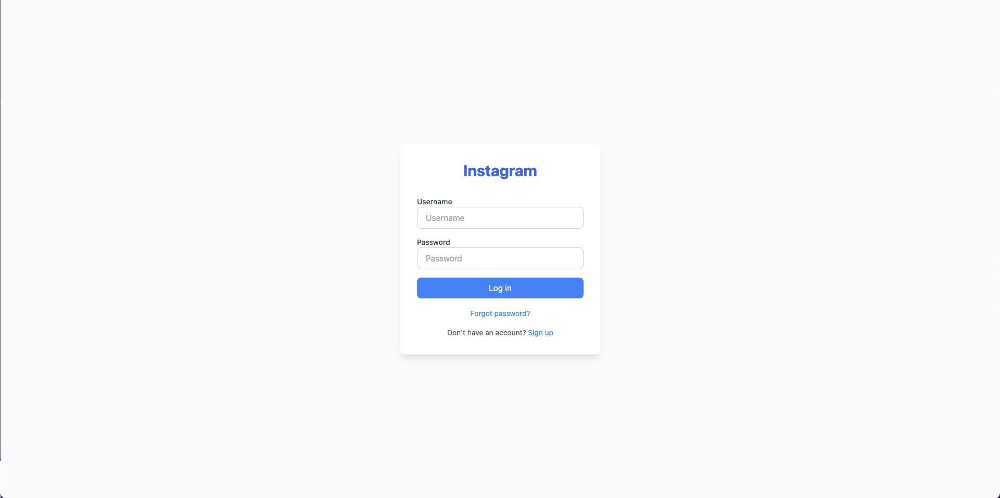
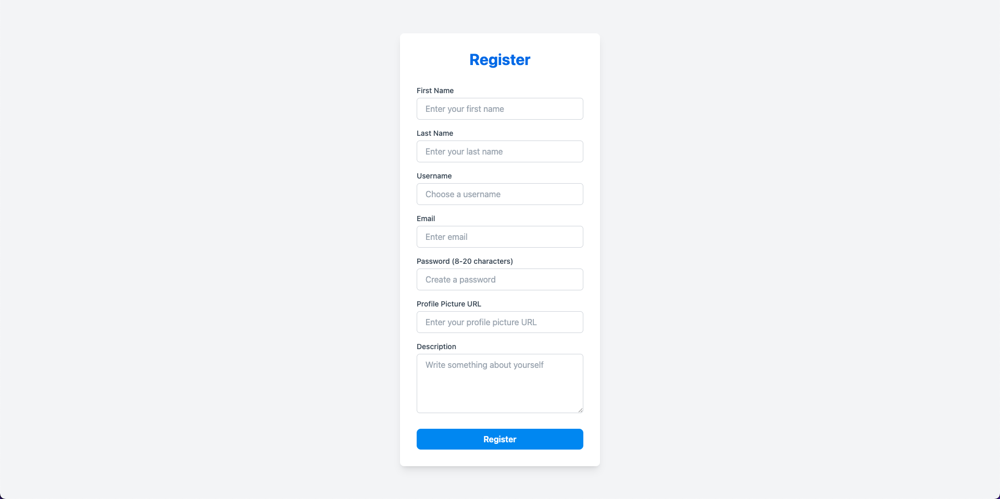
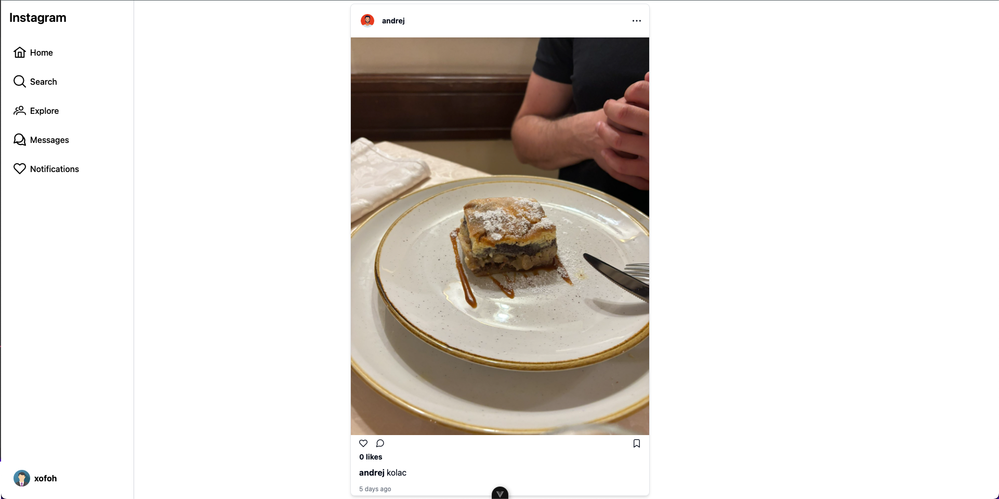
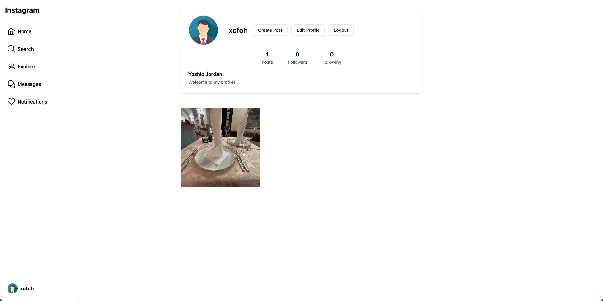
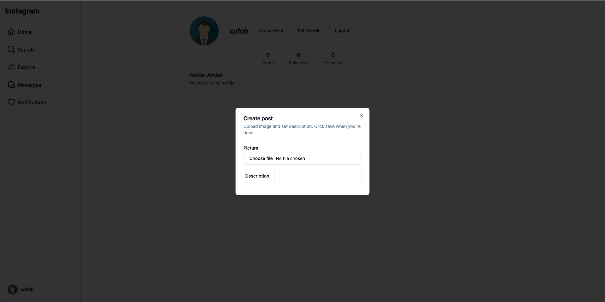
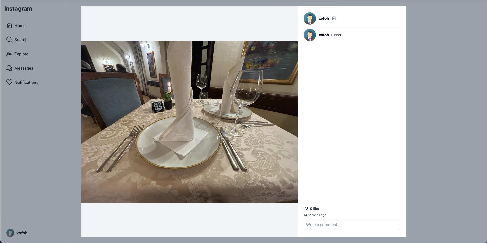
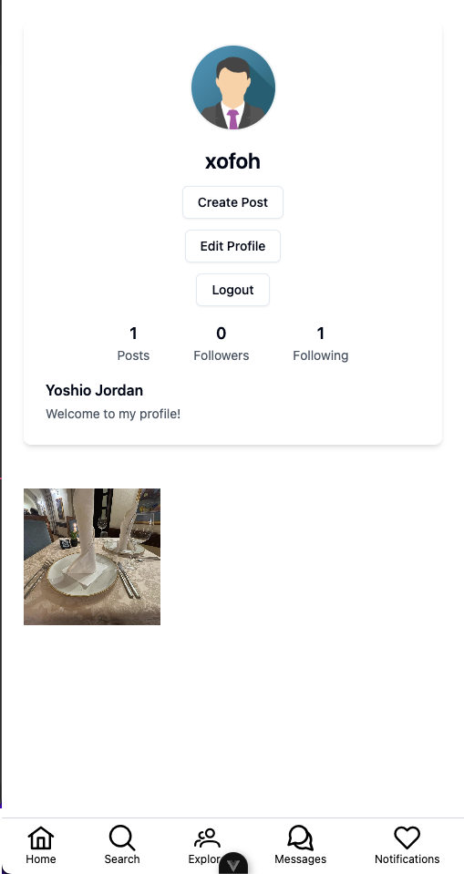

# Instagram Clone

Welcome to the **Instagram Clone**! This is a full-stack web application replicating key features of Instagram. The front-end is built using **Vue.js**, **Pinia** for state management, and the back-end is powered by **Spring Boot** with JWT-based authentication.

## 🚀 Features

### 🔑 Authentication

- **Login** and **Register** functionality.
- JWT-based security ensuring secure access to features.

### 🖼️ Post Management

- Create, edit, and delete posts (only accessible by the owner).
- Like and unlike functionality for posts.
- Home page displays posts in order from newest to oldest, with **lazy loading** for seamless scrolling.

_Create, edit, and delete posts effortlessly._

### 💬 Comment Management

- Add, edit, and delete comments (only if you're the owner).
- Real-time updates on comments.

_Engage with posts through comments._

### 🤝 Social Features

- Follow and unfollow other users.
- View posts from followed users on the home page.

_Connect with other users easily._

### 🛠️ State Management

- Utilizes **Pinia** for managing global state seamlessly.

### 🔐 Security

- Fully secured back-end using Spring Boot and JWT tokens.
- Role-based access for critical features like post and comment management.

---

## 🛠️ Tech Stack

**Front-End:**

- Vue.js 3
- Pinia (state management)
- PrimeVue & Shadcn-vue (UI components)
- TailwindCSS (styling)

**Back-End:**

- Spring Boot
- JWT Authentication
- MySQL (Database)

---

## 📷 Screenshots

### Login & Register Page


_User-friendly login form with JWT integration._



### Home Page with Lazy Loading


_Infinite scrolling for an immersive user experience._

### User Profile


_Showcase your posts and connections._

### Create Post



### Post Modal



### Responsive Profile



---

## 📂 Project Setup

1. **Clone the Repository**:

   ```bash
   git clone https://github.com/Plavsic01/Instagram-Clone-Frontend.git
   cd Instagram-Clone-Frontend
   ```

2. **Install Dependencies**:

   ```bash
   npm install
   ```

3. **Run the Application**:

   ```bash
   npm run dev
   ```

4. **Set up Back-End**:
   - Clone and configure the [Spring Boot Backend](https://github.com/Plavsic01/Instagram-Clone-Backend.git).

---

## 💡 Future Enhancements

- Add direct messaging
- Add notifications
